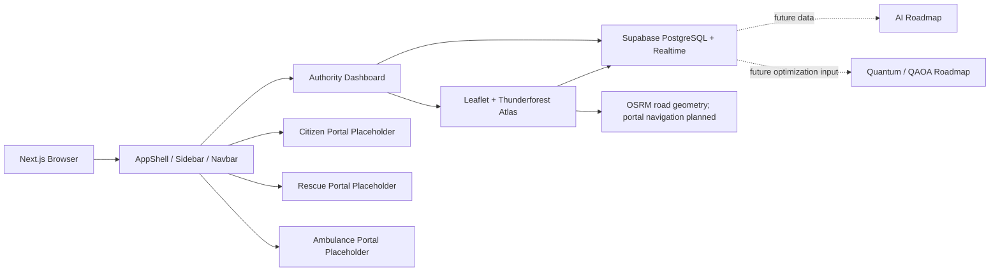

# ResQNova Master Project Documentation

> Official handover document for the current ResQNova repository. This document describes what exists in the codebase today and separates implemented work from planned work.

## Status Legend

| Marker | Meaning |
| --- | --- |
| ✅ Implemented | Present and usable in the repository or remote database workflow |
| 🚧 In Progress | Foundation exists, but the feature is incomplete or still being refined |
| 📌 Planned | Roadmap item only; not implemented in the current repository |

## 1. Project Overview

### Project Name

**ResQNova**

### Hackathon Problem Statement

ResQNova is aligned with **UC-077: Disaster-management Resource and Evacuation Optimization**. The intended system is a disaster-management command platform that helps authorities prepare resources, understand risk, coordinate response assets, and later optimize evacuation and deployment decisions.

### Current Goal

The implemented product is a Vijayawada-focused emergency command center and Digital Twin foundation. It combines:

- A futuristic command-center dashboard.
- A Leaflet GIS map using Thunderforest Atlas tiles.
- Live operational data from Supabase PostgreSQL.
- Realtime refreshes for resource and preparedness changes.
- Three separate role interfaces sourced from the supplied Citizen, Rescue, and Ambulance repositories.
- Supabase Auth routing that sends each authenticated role to its own interface.
- Authority-only overview panels for citizen SOS requests, rescue missions, and operational resources.
- Placeholder authority modules for resource and evacuation planning.
- Database foundations for future forecasting, routing, and optimization.

### Why Vijayawada / NTR

Vijayawada is the current pilot operational area inside NTR District. The database and map are now scoped around Vijayawada locations such as Benz Circle, Governorpet, Railway Station, Bus Stand, Kanaka Durga Bridge, MG Road, Eluru Road, Bhavanipuram, Krishna Lanka, and Auto Nagar.

Andhra Pradesh remains available as geographic context through the map boundary and mask data, but the operational dataset is Vijayawada-focused.

### Future Scalability

The project is structured for later additions including:

- Expanded Supabase Auth and role-specific portal workflows.
- Citizen SOS and request tracking.
- Rescue and ambulance operational synchronization.
- Hospital and shelter management.
- AI flood-risk and priority scoring.
- OSRM or GraphHopper route services for portal navigation.
- Quantum/QAOA resource and evacuation optimization.

## 2. Current Project Status

| Module | Status | Current implementation |
| --- | --- | --- |
| Theme and design system | ✅ Implemented | Tailwind tokens, glass cards, neon styling, Poppins/Inter/JetBrains Mono |
| Shared shell and navigation | ✅ Implemented | Responsive sidebar, top navbar, AppShell |
| Landing screen | ✅ Implemented | Design-system demonstration screen |
| Authority dashboard | ✅ Implemented | Live preparedness cards, command map, intelligence and quantum panels |
| Vijayawada map | ✅ Implemented | Leaflet, Thunderforest Atlas, Supabase resources, risk and road layers |
| Road-status geometry | 🚧 In Progress | Supabase road status plus OSRM geometry; traffic and official routing remain future work |
| Layer controls | ✅ Implemented | Collapsible tactical drawer with live counts and toggles |
| Fullscreen map | ✅ Implemented | Map expands and intelligence panel collapses |
| Supabase clients | ✅ Implemented | Browser and server clients |
| Supabase schema | ✅ Implemented | Operational tables, relationships, indexes, RLS foundations |
| Supabase Realtime | ✅ Implemented | Dashboard and map subscriptions |
| Vijayawada demo dataset | ✅ Implemented | Clean migration and seed workflow |
| Authentication UI | ✅ Implemented | Login/signup page, role selection, session middleware, and role redirects |
| Session controls | ✅ Implemented | Sign out is available in the Authority, Citizen, Rescue, and Ambulance interfaces |
| Auth profile conflict handling | ✅ Implemented | Seeded profile emails can be linked to newly created Auth accounts |
| Citizen portal | ✅ Integrated | External Citizen UI mounted at `/citizen`; SOS requests write to `citizen_requests` |
| Rescue portal | ✅ Integrated | External Rescue UI mounted at `/rescue`; assigned mission count syncs from Supabase |
| Ambulance portal | ✅ Integrated | External Ambulance UI mounted at `/ambulance`; assigned vehicle status syncs to Supabase |
| Authority portal separation | ✅ Implemented | Authority dashboard provides overview only; role UIs are not rendered inside the authority shell |
| Hospital portal | 📌 Planned | Role exists in the database; dedicated page is not implemented |
| Shelter portal | 🚧 Foundation only | Placeholder page |
| Resource Planner logic | 📌 Planned | Placeholder authority page only |
| Evacuation Planner logic | 📌 Planned | Placeholder authority page only |
| FastAPI backend | 📌 Planned | Empty package folders only |
| AI | 📌 Planned | No AI service or model implementation |
| Quantum optimization | 📌 Planned | UI panel and route graph foundation only; no QAOA engine |

## 3. Technology Stack

### Frontend

| Technology | Current use |
| --- | --- |
| Next.js | App Router frontend. The current installed package is `next ^16.3.4`; the original project target was Next.js 15. |
| React | Current installed package is React 19. |
| TypeScript | All application code is TypeScript/TSX. |
| Tailwind CSS | Utility styling and custom theme tokens. |
| Framer Motion | Page, card, drawer, and interaction animations. |
| Lucide React | Interface icons. |
| Leaflet | Map engine. |
| React Leaflet | React bindings for Leaflet. |
| Leaflet.heat | Dependency and type foundation for future/current incident heat rendering. |
| GeoJSON | District, flood, and polygon data format. |

### Database and Realtime

| Technology | Current use |
| --- | --- |
| Supabase | Hosted PostgreSQL, client SDK, RPC calls, and Realtime subscriptions. |
| PostgreSQL | Operational schema, SQL migrations, constraints, functions, views, and RLS. |
| `@supabase/ssr` | Browser and server Supabase client construction. |

### Map Provider

| Technology | Current use |
| --- | --- |
| Thunderforest Atlas | Current basemap tile provider. |
| OpenStreetMap contributors | Underlying map data attribution through Thunderforest. |
| OSRM | Current road-following geometry lookup for Supabase road segments. Portal navigation is planned for a later batch. |

### Backend and Future Technology

- FastAPI/Python: 📌 planned; only empty backend package folders exist.
- GraphHopper/OSRM navigation: 📌 planned for citizen, ambulance, and rescue portals. OSRM is currently used only to resolve road overlay geometry.
- QAOA/Qiskit: 📌 planned; no quantum implementation exists.

## 4. Folder Structure

Current major tree:

```text
resqnova/
├── MASTER_PROJECT_DOCUMENTATION.md
├── README.md
├── frontend/
│   ├── app/
│   │   ├── ambulance/
│   │   ├── citizen/
│   │   ├── dashboard/
│   │   ├── evacuation-planner/
│   │   ├── resource-planner/
│   │   ├── rescue/
│   │   ├── shelter/
│   │   └── settings/
│   ├── components/
│   │   ├── layout/
│   │   ├── map/
│   │   └── shared UI components
│   ├── dashboard/
│   ├── citizen/
│   ├── rescue/
│   ├── ambulance/
│   ├── shelter/
│   ├── evacuation-planner/
│   ├── resource-planner/
│   ├── lib/
│   ├── public/data/
│   ├── styles/
│   └── types/
├── backend/
│   ├── ai/
│   ├── database/
│   ├── models/
│   ├── quantum/
│   ├── routes/
│   └── services/
├── supabase/
│   ├── migrations/
│   ├── seed.sql
│   ├── config.toml
│   └── README.md
└── docs/
    └── map-data.md
```

### Folder Responsibilities

| Folder | Purpose |
| --- | --- |
| `frontend/app` | Next.js App Router route entry points. |
| `frontend/components` | Reusable UI, layout, and map components. |
| `frontend/dashboard` | Command-center dashboard composition. |
| `frontend/lib` | Supabase clients, map data fetching, dashboard metrics, navigation, and route-graph types. |
| `frontend/public/data` | Static GeoJSON files for Andhra Pradesh districts and Vijayawada flood context. |
| `frontend/types` | Shared TypeScript declarations and route graph types. |
| `backend` | Empty FastAPI-ready package structure for later services. |
| `supabase/migrations` | Ordered schema, function, policy, and dataset migrations. |
| `supabase/seed.sql` | Clean Vijayawada local/demo seed. |
| `docs` | Supporting project notes. |

## 5. Current Architecture



### Data Flow

1. The dashboard mounts the browser Supabase client.
2. `get_preparedness_metrics()` returns live dashboard aggregates.
3. `get_public_map_data()` returns public operational map data.
4. The map separately reads `flood_risk` and `deployment_zones`.
5. Supabase Realtime subscriptions trigger refetches when operational records change.
6. Leaflet renders markers, status overlays, polygons, labels, and controls.

## 5A. Role Interface Integration

The three supplied GitHub repositories are integrated as independent role experiences. They are not embedded inside the Authority Dashboard and do not replace its command-center layout.

| Role | Route | Source integration | Current Supabase connection |
| --- | --- | --- | --- |
| Citizen | `/citizen` | Citizen repository UI mounted through `CitizenPortal` | Authenticated SOS submissions create `citizen_requests` with browser GPS coordinates |
| Rescue | `/rescue` | Rescue repository UI mounted through `RescuePortal` | Authenticated rescue managers receive an active mission count from `rescue_missions` with Realtime refresh |
| Ambulance | `/ambulance` | Ambulance repository UI mounted through `AmbulancePortal` | Authenticated ambulance managers receive their assigned vehicle and status changes persist to `ambulances` |

### Login and Role Routing

- `/login` provides sign-in and account creation.
- Signup stores the selected role in Supabase Auth metadata.
- The Auth trigger creates or updates the shared `public.users` profile.
- Middleware protects role routes and redirects users to the correct portal.
- Admin users are routed to `/dashboard`, `/resource-planner`, `/evacuation-planner`, and `/settings`.
- Citizen, rescue, and ambulance interfaces remain separate from the admin authority shell.

### Authority Overview

The Authority Dashboard does not display the external portal UIs. It summarizes their operational activity through:

- Live preparedness metrics for Vijayawada.
- Supabase-backed ambulance, rescue team, hospital, shelter, road, and risk layers.
- Citizen SOS markers on the command map.
- Searchable and status-filterable citizen request feed.
- Rescue mission readiness and status stream.

The authority view is an oversight and coordination surface. Citizen actions, rescue workflows, and ambulance workflows remain in their respective portals.

## 6. UI Design System

### Color Tokens

| Token | Hex | Use |
| --- | --- | --- |
| Background | `#07111F` | Main application background |
| Secondary | `#0D1726` | Shell and secondary surfaces |
| Card | `#101C2C` | Card surfaces |
| Primary | `#00D4FF` | Cyan actions, map controls, active state |
| Success | `#22C55E` | Ready/open/available state |
| Warning | `#FACC15` | Restricted, caution, partial state |
| Danger | `#EF4444` | High risk and blocked state |
| Purple accent | `#8B5CF6` | Rescue and quantum accent |
| Text | `#E6F1FF` | Primary text |

### Typography

- Poppins: headings through `--font-poppins`.
- Inter: body text through `--font-inter`.
- JetBrains Mono: metrics, coordinates, timestamps, and status readouts through `--font-jetbrains-mono`.
- Font variables are defined globally with local system fallbacks so production builds do not depend on Google Fonts being reachable.

### Visual Language

- Glassmorphism surfaces with translucent backgrounds and blur.
- Rounded `rounded-xl` and `rounded-2xl` components.
- Cyan neon borders and hover glows.
- Soft shadows and restrained gradients.
- Dark emergency-operations-center atmosphere.
- Responsive sidebar drawer on mobile.
- Framer Motion fade and drawer transitions.

### Reusable Components

| Component | Purpose |
| --- | --- |
| `GlassCard` | Shared glass surface. |
| `MetricCard` | Dashboard metric display. |
| `NeonButton` | Primary futuristic action button. |
| `StatusBadge` | State/status label. |
| `AlertBanner` | Loading/error/info message. |
| `LoadingSpinner` | Loading indicator. |
| `Sidebar` | Responsive navigation. |
| `TopNavbar` | Page heading, status, menu, notification affordance. |
| `AppShell` | Shared authenticated-area layout foundation. |
| `LayerControls` | Collapsible map layer drawer. |

## 7. Dashboard Documentation

### Route

`/dashboard`

### Header

The current dashboard is titled **Vijayawada Command Center** and describes Vijayawada resource readiness and flood-risk monitoring.

### Live Metric Cards

| Card | Supabase source/current calculation |
| --- | --- |
| High-Risk Zones | Count of NTR risk zones with `risk_level` `high` or `critical`. |
| Ready Ambulances | Count of Vijayawada ambulances with `status = 'available'`. |
| Ready Rescue Teams | Count of Vijayawada teams with operational status and ready/standby readiness. |
| Available Shelter Capacity | Sum of `shelters.available_capacity` in NTR. |

The cards have loading skeletons, empty state, and error state handling. The dashboard subscribes to ambulance, rescue-team, shelter, risk-zone, and forecast changes.

### Preparedness Overview

The dashboard shows:

- Forecast Status.
- Resource Readiness.
- Evacuation Readiness.

These values come from `get_preparedness_metrics()`.

### Command Map

The map is the main dashboard centerpiece. It includes:

- Thunderforest Atlas tiles.
- Vijayawada camera focus.
- Supabase resource markers.
- Compact risk polygons.
- Optional roads, closures, deployments, flood context, villages, and cluster layers.
- Fullscreen mode.
- Locate control.
- Zoom and scale controls.
- Layer drawer.

### Intelligence Panel

The current dashboard includes an `IntelligencePanel` component. It is a presentation panel for emergency intelligence content and is not currently a full AI inference service.

### Quantum Decision Panel

The current `QuantumDecisionPanel` is a visual signature panel for optimization readiness. It does not execute QAOA, quantum simulation, allocation, or rerouting.

### Resource Planner

`/resource-planner` is a visually complete authority placeholder showing resource-prepositioning sections and a disabled optimization action.

### Evacuation Planner

`/evacuation-planner` is a visually complete authority placeholder showing high-risk villages, shelters, safe routes, evacuation summary, and a disabled optimization action. Operational navigation is intentionally reserved for future portal work.

## 8. Map Documentation

### Main Component

`frontend/components/map/APMap.tsx` mounts the Leaflet map dynamically with SSR disabled through `CommandCenterMap`.

### Basemap

- Provider: Thunderforest Atlas.
- API key: `NEXT_PUBLIC_THUNDERFOREST_API_KEY`.
- Missing key behavior: a clean basemap-unavailable panel is shown instead of broken tiles or repeated watermark text.
- Attribution is included for Thunderforest and OpenStreetMap contributors.

### Camera and Bounds

- Initial operational focus: Vijayawada.
- Vijayawada bounds: latitude `16.45` to `16.60`, longitude `80.58` to `80.73`.
- Andhra Pradesh bounds remain as map context and panning limits.
- `fitBounds()` focuses the Vijayawada operational rectangle on first load.
- Leaflet supports wheel zoom, double-click zoom, dragging, and touch zoom.

### Live Layers

| Layer | Data source | Current behavior |
| --- | --- | --- |
| Ambulances | Supabase `ambulances` | Cyan tactical markers with glass popups |
| Rescue Teams | Supabase `rescue_teams` | Blue shield markers |
| Hospitals | Supabase `hospitals` | Blue medical markers |
| Shelters | Supabase `shelters` | Green house markers |
| Roads | Supabase `roads` + OSRM geometry | Road-following status overlays when enabled |
| Road Closures | Supabase `roads` filtered to non-open | Enabled by default; no straight-line fallback |
| Risk Zones | Supabase `flood_risk` view | Compact color-coded polygons |
| Deployment Zones | Supabase `deployment_zones` | Optional translucent sectors |
| Flood Zones | Static GeoJSON | Optional contextual flood polygons |
| Villages | Static component data | Optional context markers |
| Resource Clusters | Computed frontend layer | Optional clustered resource counts |

### Road Geometry

Road records contain endpoints and status metadata. `OperationalLayers.tsx` sends endpoints to the configured OSRM base URL, or the public OSRM fallback, and renders returned GeoJSON route geometry. The component deliberately does not draw a straight endpoint-to-endpoint line if route geometry is unavailable.

The map is not currently a live traffic navigation system. Real navigation for citizens, ambulance crews, and rescue teams is planned for their portals.

### Marker and Popup Components

`OperationalLayers.tsx` contains reusable SVG marker definitions and popups for:

- Ambulances: status, crew, fuel, deployment, update time.
- Rescue teams: type, personnel, readiness, equipment.
- Hospitals: emergency capacity, ICU beds, ambulance availability.
- Shelters: capacity, occupancy, food, water, power backup.
- Incidents: type, priority, confidence, status.

### Map Components

| File | Responsibility |
| --- | --- |
| `APMap.tsx` | Map container, basemap, controls, layer composition, data lifecycle. |
| `DistrictLayer.tsx` | Andhra Pradesh district GeoJSON rendering. |
| `APMaskLayer.tsx` | Geographic context mask. |
| `LayerControls.tsx` | Tactical drawer and toggles. |
| `OperationalLayers.tsx` | Markers, popups, and road-status geometry. |
| `TacticalCoverageLayers.tsx` | Coverage circles, risk polygons, deployment polygons. |
| `VijayawadaContextLayers.tsx` | Tactical labels, static flood GeoJSON, resource clusters. |
| `NtrContextLayers.tsx` | Village and legacy context helpers. |
| `IncidentHeatLayer.tsx` | Leaflet heat foundation for incident visualization. |
| `RouteGraphLayer.tsx` | Route graph visualization foundation; not currently mounted in the command map. |
| `AnimatedRouteLayer.tsx` | Reusable animated route foundation; not an active optimization engine. |

### Current Map Limitations

- OSRM road geometry is route geometry, not live traffic or official road-closure geometry.
- Supabase road records store segment endpoints rather than authoritative full road shapes.
- No authenticated map editing workflow exists.
- No AI flood prediction or dynamic risk generation exists.
- Portal navigation is intentionally outside the Authority Dashboard and remains a future routing integration for the separate citizen, ambulance, and rescue workflows.
- Static context GeoJSON is not a realtime hydrology feed.

## 9. Supabase Documentation

### Supabase Clients

| File | Purpose |
| --- | --- |
| `frontend/lib/supabase/client.ts` | Cached browser client using public URL and anon key. |
| `frontend/lib/supabase/server.ts` | Server client using Next.js cookies and SSR support. |

Both clients validate that the URL is HTTP/HTTPS and that both environment variables exist.

### Tables

#### `users`

Purpose: Application profile and role record linked to Supabase Auth.

| Column | Type/notes |
| --- | --- |
| `id` | UUID primary key |
| `auth_id` | UUID, unique, references `auth.users(id)` |
| `full_name` | Text |
| `email` | Unique text |
| `phone` | Text, nullable |
| `role` | `user_role` enum: admin, citizen, rescue, ambulance, shelter, hospital |
| `district` | Text, nullable |
| `created_at` | Timestamp |

#### `incidents`

Purpose: Citizen-reported or authority-managed disaster incidents.

Key columns: `id`, `citizen_id`, `title`, `description`, `disaster_type`, `latitude`, `longitude`, `district`, `priority`, `confidence`, `status`, `assigned_rescue_team`, `assigned_ambulance`, `assigned_hospital`, `assigned_shelter`, `created_at`.

Relationships: `citizen_id -> users.id`; assignment fields reference rescue teams, ambulances, hospitals, and shelters.

#### `citizen_profiles`

Purpose: Citizen-specific profile information linked to Supabase Auth.

Key columns: `id`, `auth_id`, `name`, `phone`, `address`, `emergency_contact`, `role`, `created_at`.

#### `citizen_requests`

Purpose: Authenticated SOS requests submitted by the Citizen Portal and monitored by the Authority Dashboard.

Key columns: `id`, `request_id`, `citizen_id`, `latitude`, `longitude`, `people_count`, `emergency_type`, `photo_url`, `voice_note_url`, `risk_level`, `ai_confidence`, `priority_score`, `status`, `rescue_team_id`, `ambulance_id`, `assigned_at`, `eta`, `created_at`.

Realtime behavior: new and updated requests appear in the authority map as tactical SOS markers and in the searchable request feed.

#### `rescue_missions`

Purpose: Rescue assignments associated with citizen requests.

Key columns: `id`, `request_id`, `rescue_team_id`, `ambulance_id`, `latitude`, `longitude`, `mission_status`, `readiness`, `last_updated`.

The Rescue Portal reads its assigned active mission count, while the Authority Dashboard shows the mission readiness stream.

#### `notifications`

Purpose: Role-scoped notification foundation for citizen and responder updates.

Key columns: `id`, `user_id`, `citizen_id`, `title`, `message`, `type`, `read`, `created_at`.

#### `rescue_teams`

Purpose: Rescue resource locations and readiness.

Key columns: `id`, `team_name`, `leader`, `manager_auth_id`, `latitude`, `longitude`, `status`, `assigned_incident`, `updated_at`, `deployment_zone`, `team_type`, `personnel`, `equipment`, `readiness`.

#### `ambulances`

Purpose: Ambulance inventory and current operational location.

Key columns: `id`, `vehicle_code`, `manager_auth_id`, `latitude`, `longitude`, `status`, `assigned_incident`, `updated_at`, `deployment_zone`, `crew_size`, `fuel`.

Allowed statuses are `available`, `dispatched`, `maintenance`, and `offline`.

#### `shelters`

Purpose: Shelter capacity and supply readiness.

Key columns: `id`, `shelter_name`, `manager_auth_id`, `district`, `latitude`, `longitude`, `capacity`, `available_capacity`, `food_stock`, `medical_stock`, `updated_at`, `occupancy`, `water_stock`, `power_backup`.

#### `hospitals`

Purpose: Hospital bed and emergency-resource readiness.

Key columns: `id`, `hospital_name`, `manager_auth_id`, `district`, `latitude`, `longitude`, `total_beds`, `available_beds`, `emergency_capacity`, `updated_at`, `icu_beds`, `ambulances_available`.

#### `roads`

Purpose: Operational road status and route metadata.

Key columns: `id`, `road_name`, `district`, `status`, `blocked_reason`, `updated_at`, `travel_time`, `risk_score`, `name`, `start_lat`, `start_lng`, `end_lat`, `end_lng`, `road_type`.

Allowed statuses are `open`, `blocked`, `restricted`, and `under_review`.

#### `alerts`

Purpose: District-scoped operational alerts.

Columns: `id`, `title`, `description`, `severity`, `district`, `created_at`.

#### `forecast_scenarios`

Purpose: Future forecast/risk scenario storage.

Columns: `id`, `scenario_name`, `district`, `rainfall`, `risk_level`, `created_at`.

#### `risk_zones`

Purpose: Polygon risk areas for the Digital Twin.

Columns: `id`, `zone_name`, `district`, `risk_level`, `risk_score`, `polygon`, `created_at`.

#### `deployment_zones`

Purpose: Resource staging sectors.

Columns: `id`, `zone_name`, `district`, `ready_units`, `capacity`, `coverage`, `polygon`, `updated_at`.

#### `travel_time_edges`

Purpose: Future route-graph and optimization input.

Columns: `id`, `source`, `destination`, `distance`, `normal_time`, `emergency_time`, `congestion_factor`, `road_status`, `created_at`.

### Views and RPC Functions

| Object | Purpose |
| --- | --- |
| `dashboard_metrics` | Legacy aggregate view from the foundation migration. |
| `flood_risk` | Read-only view over `risk_zones`. |
| `get_public_map_data()` | Public map payload for incidents, resources, hospitals, shelters, and roads. |
| `get_preparedness_metrics()` | Live dashboard metrics and readiness labels. |

### Indexes

Indexes exist for incident citizen/status/district access, resource assignments, district lookups, forecast district/risk, deployment zones, roads geometry, hospital/shelter districts, risk zones, and route graph sources.

### Row-Level Security

RLS is enabled for the operational tables. Current policy foundations include:

- Citizens can create and update their own incidents.
- Citizens can view their own incidents.
- Assigned rescue, ambulance, hospital, and shelter managers can view related incidents.
- Resource managers can update their own managed resource.
- Authenticated users can view operational resources according to current policies.
- Admins can manage all protected records through `public.is_admin()`.
- Public map RPCs and selected map views provide the dashboard’s read path.

### Realtime Usage

The frontend subscribes to PostgreSQL changes for:

- `ambulances`
- `rescue_teams`
- `hospitals`
- `shelters`
- `roads`
- `flood_risk`
- `deployment_zones`
- `citizen_requests`
- `rescue_missions`
- Dashboard preparedness tables including forecast scenarios

A change triggers a refetch rather than manually mutating every Leaflet object.

## 10. Current Dataset

The clean Vijayawada dataset is defined by the latest migrations and `supabase/seed.sql`.

| Dataset | Current count | Current scope |
| --- | ---: | --- |
| Ambulances | 20 | Vijayawada operational coordinates |
| Rescue teams | 6 | Vijayawada staging locations |
| Hospitals | 8 | Vijayawada/NTR support facilities |
| Shelters | 5 | Core Vijayawada shelter locations |
| Roads | 12 | Vijayawada road segments |
| Risk zones | 4 | Compact Vijayawada risk polygons |
| Deployment zones | 3 | Central, riverfront, and east Vijayawada sectors |
| Travel-time edges | 8 | Vijayawada route graph foundation |
| Incidents | 0 in clean operational reset | Incident workflows are not seeded in the current focused dataset |

### Mock Versus Live

- The records are demo/seed data, not an external government live feed.
- Once inserted into Supabase, the dashboard and map read the records live from Supabase.
- Realtime updates are real database updates, but the underlying demo values are synthetic until connected to authoritative sources.
- Thunderforest/OpenStreetMap provide real basemap geography.
- OSRM provides route geometry for road overlays, not live traffic or official incident truth.

## 11. Authentication

### Current Implementation

- Role enum exists in PostgreSQL.
- Supabase Auth trigger creates a profile row in `public.users` for new Auth users.
- Browser and server Supabase clients are prepared.
- Role helper functions exist: `has_role()` and `is_admin()`.
- RLS policies use the authenticated user and role helpers.
- `/login` supports sign-in and signup for admin, citizen, rescue, ambulance, shelter, and hospital roles.
- Supabase email confirmation is enabled, so signup requires a real inbox before the first sign-in.
- Middleware protects role routes and redirects authenticated users to their allowed interface.
- Citizen, rescue, and ambulance role interfaces are mounted from the supplied external repositories.
- Sign out clears the Supabase session and returns the user to `/login` from every implemented interface.

### Not Implemented

- Password reset UX.
- Admin user management UI.

### Login Troubleshooting

- The demo emails in `supabase/seed.sql` are profile rows only; they do not contain Auth passwords.
- Use a real email address when registering so Supabase can deliver the confirmation link.
- If an existing seeded email is used, migration `20260910000009_auth_profile_conflict_fix.sql` links the new Auth account to the existing profile instead of failing on the unique email constraint.
- The Authority Dashboard requires a user whose `public.users.role` is `admin`. Admin is available in the current signup form for development/demo setup; production deployments should restrict admin creation and use an administrator approval flow.

### Roles

`admin`, `citizen`, `rescue`, `ambulance`, `shelter`, and `hospital` are supported as database roles.

## 12. Citizen Portal Specification

Status: ✅ Integrated external UI with Supabase SOS submission foundation.

The intended Citizen Portal should later provide:

- SOS creation with location and disaster type.
- Request tracking and status history.
- District alerts.
- Safe-route lookup.
- Push or in-app notifications.
- Nearby shelter finder.
- Hospital and emergency assistance information.

The current `/citizen` route mounts the supplied Citizen UI. Its SOS transmitter captures high-accuracy browser coordinates and writes authenticated requests to `citizen_requests`; the authority map and operations panel subscribe to those updates.

## 13. Authority Dashboard Specification

### Implemented

- Vijayawada command-center shell.
- Live preparedness metrics.
- Live Supabase map resources.
- Tactical layers and map controls.
- Fullscreen map mode.
- Resource and evacuation planner placeholders.
- Intelligence and quantum presentation panels.

### Planned

- Authenticated authority access.
- Incident intake and triage.
- AI priority scoring.
- Forecast scenario creation.
- Assignment workflows.
- Alert publishing.
- Operational audit trail.
- Advanced analytics and historical playback.

## 14. Resource Planner

### Current

The `/resource-planner` page is a placeholder authority module with sections for:

- Rescue Teams.
- Ambulances.
- Shelter Readiness.
- Hospital Readiness.
- Optimize Deployment action.

The action is disabled and no deployment algorithm currently runs.

### Planned Inputs

- Resource availability and readiness.
- Location and deployment zone.
- Forecast scenario and risk score.
- Road status and travel time.
- Hospital/shelter capacity.
- Personnel and equipment constraints.

### Planned Outputs

- Pre-positioned ambulance assignments.
- Rescue staging recommendations.
- Shelter readiness priorities.
- Explainable deployment plan.

## 15. Evacuation Planner

### Current

The `/evacuation-planner` page is a placeholder with sections for high-risk villages, available shelters, safe routes, and an evacuation summary. Its optimization button is disabled.

### Planned

- Select a risk zone or village.
- Select shelters and capacity constraints.
- Calculate road-following safe routes.
- Avoid blocked or flooded segments.
- Produce a citizen-facing route.
- Send a dispatch route to ambulance/rescue portals.

The current command map no longer includes a navigation widget. Portal-specific navigation will be implemented later.

## 16. AI Roadmap

Status: 📌 Planned.

Potential future features:

- Rainfall and flood prediction.
- Flood-risk polygon generation.
- Incident priority calculation.
- Road accessibility classification.
- Resource demand forecasting.
- Natural-language command summaries.

Proposed priority formula:

```text
Priority = Risk × People × FloodScore × Accessibility
```

No AI model, inference endpoint, training pipeline, or Python AI service exists in the current repository.

## 17. Quantum Roadmap

Status: 📌 Planned.

Potential QAOA/Qiskit optimization targets:

- Pre-positioning ambulances before a forecast event.
- Ambulance-to-incident allocation.
- Rescue-team-to-zone allocation.
- Shelter assignment under capacity constraints.
- Multi-objective evacuation planning.
- Flood-aware route selection.

The current project contains a route graph schema, route graph types, and a visual quantum decision panel. It does not contain a quantum circuit, QAOA solver, simulator integration, or optimization API.

## 18. Friend Integration Guide

### Friend 1: Citizen, Rescue, and Ambulance Portals

These portals should integrate through Supabase tables and shared types.

Recommended integration points:

- Citizen creates `incidents` with `citizen_id`, coordinates, description, and disaster type.
- Rescue portal reads assigned incidents and updates rescue-team status/location.
- Ambulance portal reads assigned incidents and updates vehicle status/location.
- The command map receives updates through Supabase Realtime.
- Portal-specific navigation should call OSRM or GraphHopper and render routes in the portal UI.

### Friend 2: Hospital and Shelter Portals

Recommended integration points:

- Hospital portal updates `available_beds`, `emergency_capacity`, `icu_beds`, and ambulance availability.
- Shelter portal updates occupancy, available capacity, food, water, medical stock, and power backup.
- The command dashboard receives updated capacity and readiness values through the existing RPC and Realtime subscriptions.

### Shared Contract

Use the existing table IDs and UUID relationships. Do not create parallel resource tables. Use `manager_auth_id` and role-aware RLS for ownership once Auth flows are implemented.

## 19. Environment Variables

Current variables found in `frontend/.env.local`:

| Variable | Purpose | Secret handling |
| --- | --- | --- |
| `NEXT_PUBLIC_SUPABASE_URL` | Supabase project URL. | Public runtime configuration. |
| `NEXT_PUBLIC_SUPABASE_ANON_KEY` | Supabase browser anon key. | Public client key; RLS must protect data. |
| `NEXT_PUBLIC_THUNDERFOREST_API_KEY` | Thunderforest Atlas tile access. | Exposed to browser because map tiles load client-side; usage should be restricted/rotated according to provider policy. |
| `NEXT_PUBLIC_OSRM_URL` | Optional OSRM base URL for road geometry. | Optional public URL; falls back to the public OSRM service when absent. |

Never commit actual credentials or tokens to documentation. This document intentionally contains variable names only.

## 20. Installation Guide

### Frontend

```bash
cd frontend
npm install
npm run dev
```

Open `http://localhost:3000`.

### Environment

Create `frontend/.env.local`:

```env
NEXT_PUBLIC_SUPABASE_URL=https://YOUR_PROJECT.supabase.co
NEXT_PUBLIC_SUPABASE_ANON_KEY=YOUR_ANON_KEY
NEXT_PUBLIC_THUNDERFOREST_API_KEY=YOUR_THUNDERFOREST_KEY
# Optional:
# NEXT_PUBLIC_OSRM_URL=https://router.project-osrm.org
```

Restart the Next.js server after changing environment variables.

### Supabase Remote Project

From the repository root:

```bash
npx supabase login
npx supabase link --project-ref YOUR_PROJECT_REF
npx supabase db push
```

The latest migrations clean the operational dataset and apply the Vijayawada-focused records and RPC functions.

### Seed Data

For a manually controlled seed:

```bash
psql "$SUPABASE_DB_URL" -f supabase/seed.sql
```

Alternatively, run `supabase/seed.sql` in the Supabase SQL Editor after migrations.

### Local Supabase

Local `supabase start` and `supabase db reset` require Docker Desktop or Podman. Without one of those runtimes, use the remote `db push` workflow.

## 21. Deployment Guide

### Frontend

1. Deploy the `frontend` directory to a Next.js-compatible host such as Vercel or another Node hosting provider.
2. Set the four `NEXT_PUBLIC_*` variables in the host environment.
3. Run the production build and start commands configured by the host.
4. Ensure the Thunderforest key is valid for the deployed origin.

### Supabase

1. Link the project with the Supabase CLI.
2. Apply migrations with `npx supabase db push`.
3. Run the clean seed only in an intentional demo/development environment.
4. Confirm Realtime is enabled for the operational tables used by the frontend.
5. Review RLS policies before adding production writes.

### Backend

There is currently no deployable FastAPI application. The backend folders are placeholders. Future backend deployment should define an API entry point, dependency file, environment contract, authentication verification, and service deployment target.

## 22. Verification and Maintenance

### Current Checks

The frontend TypeScript check passes with:

```bash
cd frontend
npx tsc --noEmit
```

The production build also passes with:

```bash
cd frontend
npm run build
```

### Latest Completed Fixes

- Realtime subscriptions now create unique channel names for each map/dashboard consumer. This prevents Supabase from rejecting callbacks added after a channel has already subscribed.
- Dashboard metric cards pass React `key` values directly instead of spreading `key` through component props.
- Citizen, Rescue, Ambulance, and Authority interfaces all expose a sign-out action.
- Admin is available as a development/demo signup role and routes to the Authority Dashboard.
- Migration `20260910000009_auth_profile_conflict_fix.sql` safely links seeded `public.users` email profiles to new Supabase Auth users.
- Login catches client and Supabase errors and displays them in the login form.

### Known Build Caveat

The production build uses global font variables with local system fallbacks. It does not require a network request to Google Fonts, so restricted or offline environments can still complete `next build`.

### Migration Rules

- Add new migrations; do not rewrite migrations already applied to the remote project.
- The latest focus migrations intentionally delete and replace operational demo data.
- Never run the destructive clean dataset migrations against production data without approval and backup.
- Keep portal-specific writes behind authenticated RLS policies.

## 23. Demo Flow

The following is the recommended hackathon demonstration based on currently implemented functionality:

1. Open the ResQNova landing or dashboard route.
2. Enter the **Vijayawada Command Center** view.
3. Explain that Vijayawada is the focused NTR operational area.
4. Show live preparedness cards for high-risk zones, ambulances, rescue teams, and shelter capacity.
5. Open the tactical layer drawer and demonstrate live counts.
6. Toggle ambulance, rescue, hospital, and shelter markers.
7. Click a resource marker to show its operational glass popup.
8. Enable road closures to show road-following blocked/restricted segments.
9. Toggle the compact risk layer and explain the Krishna Riverfront, Kanaka Durga, Bhavanipuram, and Krishna Lanka focus.
10. Demonstrate fullscreen mode and locate control.
11. Open Resource Planner and explain that deployment optimization is the next authority workflow.
12. Open Evacuation Planner and explain that portal-specific route planning is planned.
13. Show the Quantum Decision panel as the future optimization identity, clearly stating that the solver is not yet implemented.
14. Close with the roadmap: authenticated portals, AI forecasting, route services, and QAOA optimization.

## Final Handover Summary

ResQNova currently provides a functioning Vijayawada emergency command-center foundation with a live Supabase-backed dashboard and Leaflet map. The strongest completed capability is the Digital Twin presentation and operational resource visualization. Authentication UX, citizen/responder workflows, AI prediction, and quantum optimization are intentionally not complete and should be built on the existing contracts rather than replacing the current dashboard architecture.
